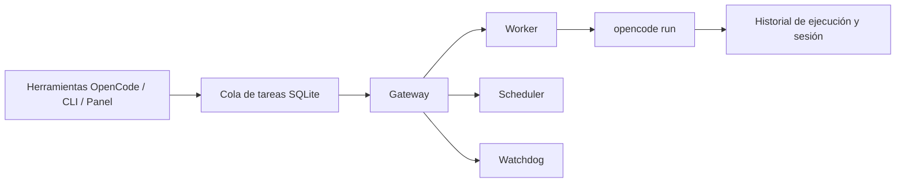

# SuperTask

<p align="center"><strong>Encola. Programa. Reintenta. Sabe qué ocurrió.</strong></p>

<p align="center">
  <a href="https://www.npmjs.com/package/opencode-supertask"></a>
  <a href="https://github.com/vbgate/opencode-supertask/actions/workflows/ci.yml"></a>
  <a href="https://opensource.org/licenses/MIT"></a>
</p>

<p align="center">
  <a href="https://github.com/vbgate/opencode-supertask/blob/main/README.md">English</a> | <a href="https://github.com/vbgate/opencode-supertask/blob/main/README.zh-CN.md">简体中文</a> | <strong>Español</strong>
</p>

SuperTask convierte los comandos puntuales `opencode run` en operaciones durables de agentes. Ofrece a los agentes de OpenCode una cola SQLite persistente, programación, reintentos, control de concurrencia, cancelación segura, historial de ejecución y un panel web local.

OpenCode puede ejecutar un agente ahora. SuperTask garantiza que el trabajo siga rastreado tras cerrar el terminal, si el proceso falla o si la máquina se reinicia.

## ¿Por qué SuperTask?

| Si necesitas... | Usa |
| --- | --- |
| Ejecutar un agente una sola vez | `opencode run` |
| Ejecutar unos pocos comandos fijos a horas fijas | `cron`, `launchd`, `systemd` o GitHub Actions |
| Reiniciar un proceso de larga duración con una programación | PM2 `cron_restart` |
| Gestionar trabajos de agentes variables con estado durable, reintentos, prioridades e historial | **SuperTask** |

SuperTask no es otro envoltorio sobre cron. El trabajo programado se convierte en una tarea normal de la cola durable, de modo que los trabajos manuales y programados comparten las mismas reglas de concurrencia, reintento, cancelación, dependencia e historial.

## Qué obtienes

| Capacidad | Qué significa |
| --- | --- |
| Cola durable | Las tareas y cada ejecución sobreviven a reinicios de proceso y de máquina en SQLite WAL |
| Tres tipos de programación | Cron, retraso de una sola vez e intervalo fijo recurrente |
| Recuperación automática | Presupuesto de reintentos, backoff exponencial, estado dead-letter y reintento manual |
| Ejecución controlada | Concurrencia global, orden por prioridad, dependencias y serialización global por lote |
| Conciencia de proyecto | Cada tarea conserva su directorio de proyecto OpenCode, agente, modelo y variante opcional |
| Manejo seguro de procesos | Cancelación y apagado esperan a que el grupo de procesos Unix gestionado de OpenCode se drene |
| Ejecuciones observables | ID de sesión, comando exacto reproducible, salida del modelo, herramientas, errores y JSONL en bruto |
| Panel local | Crear, programar, inspeccionar, reintentar, cancelar y diagnosticar desde `127.0.0.1` |

## Inicio rápido en tres minutos

### 1. Instala una versión exacta

```bash
VERSION="$(npm view opencode-supertask dist-tags.latest)"
npm install -g "opencode-supertask@$VERSION"
opencode plugin "opencode-supertask@$VERSION" --global --force
```

Fijar la versión exacta mantiene alineados el plugin de OpenCode, la CLI global y el Gateway. No lo sustituyas por el nombre del paquete sin versión ni por `@latest` en `opencode.json`.

### 2. Reinicia OpenCode e inicia el Gateway

```bash
supertask install   # recomendado: arranque con PM2, recuperación ante fallos y rotación de logs
```

Para desarrollo en primer plano:

```bash
supertask gateway
```

El plugin nunca instala servicios globales al arrancar OpenCode. La configuración de PM2 solo ocurre cuando ejecutas explícitamente `supertask install`.

### 3. Pide a OpenCode que cree una tarea

```text
Crea una SuperTask llamada "Revisar errores de API".
Usa el agente build en este proyecto, reintenta dos veces y ejecútala ahora.
```

OpenCode recibe ocho herramientas nativas del plugin `supertask_*`. El directorio del proyecto actual se toma del contexto de herramientas de OpenCode y no se confía en la entrada del modelo.

### 4. Observa la ejecución

```bash
supertask status
supertask list --limit 10
supertask ui
```

El panel se abre en <http://127.0.0.1:4680>.

## Cómo funciona



Un único Gateway posee las transiciones de estado en tiempo de ejecución. Los clientes crean y gestionan trabajo; solo el Gateway marca las ejecuciones como iniciadas, completadas, fallidas, reintentadas o canceladas.

## Úsalo a tu manera

### Lenguaje natural en OpenCode

```text
Ejecuta una revisión de seguridad con el agente build, el modelo provider/model y la variante high.

Cada día laborable a las 9:00, crea una tarea de informe para este proyecto.

Muestra las tareas fallidas de este proyecto y reintenta las recuperables.

Comprueba si el lote "release" se está ejecutando en otro proyecto.
```

Herramientas del plugin disponibles:

```text
supertask_add       supertask_schedule  supertask_status   supertask_retry
supertask_list      supertask_get       supertask_next     supertask_upgrade
```

### CLI

```bash
# Encolar trabajo
supertask add --name "Revisión de seguridad" --agent build \
  --model openai/gpt-5.6-sol --variant xhigh \
  --prompt "Revisar autenticación y autorización" \
  --importance 5 --urgency 4 --max-retries 2 \
  --retry-backoff 30s --timeout 30min

# Programar trabajo
supertask template add --name "Informe laborable" --agent build \
  --model openai/gpt-5.6-sol --variant high \
  --prompt "Resumir cambios importantes del proyecto" \
  --type cron --cron "0 9 * * 1-5"

# Inspeccionar y recuperar
supertask status
supertask list --status failed --limit 20
supertask retry --id 42
supertask cancel --id 42
```

Ejecuta `supertask --help` o `supertask <command> --help` para la superficie completa de comandos. La ayuda de la CLI y los diagnósticos legibles admiten `auto`, `en`, `es` y `zh-CN`.

## Panel

El panel adaptable admite inglés, español y chino, temas claro y oscuro, y cuatro vistas centradas:

| Página | Propósito |
| --- | --- |
| Cola de tareas | Explorar proyectos, crear/editar tareas, ver prioridades y estado activo, reintentar, cancelar o eliminar con seguridad |
| Tareas programadas | Crear/editar plantillas cron, retrasadas y recurrentes; ejecutar una de inmediato sin saltarse la cola |
| Registros de ejecución | Leer salida estructurada, herramientas, errores, sesiones y el comando histórico exacto |
| Estado del sistema | Inspeccionar la configuración activa, la salud, la concurrencia y el mantenimiento de la base de datos con copia de seguridad previa |

El selector de proyectos lee la salida real de `opencode agent list` y `opencode models --verbose` del directorio elegido, de modo que los formularios solo ofrecen modelos disponibles localmente, las variantes declaradas de cada modelo y agentes directamente ejecutables. Dejar la variante en su valor predeterminado omite `--variant` y sigue la configuración del agente/modelo.

## Fiabilidad sin rodeos

- SQLite `BEGIN IMMEDIATE` protege el bloqueo de un solo Gateway y la serialización global por lote.
- La selección de candidatos y la transición a `running` ocurren en una sola transacción inmediata, de modo que ediciones concurrentes no pueden alterar una tarea reclamada.
- Cada ejecución gestionada tiene una identidad de lanzador única y un grupo de procesos Unix aislado.
- Una ejecución solo se cierra después de que el lanzador demuestra que todo el grupo de procesos se ha drenado.
- La contención de procesos termina en ese grupo: los descendientes que llaman deliberadamente a `setsid()` o arrancan como daemons desacoplados deben gestionar su propio ciclo de vida.
- El apagado y la cancelación fallan de forma cerrada cuando no se puede demostrar la propiedad del proceso.
- `supertask doctor` verifica OpenCode, el plugin fijado efectivo, la caché, la CLI, el paquete del Gateway, el bloqueo de listo, SQLite, el panel y el entorno PM2.
- Vaciar y restaurar la base de datos son operaciones transaccionales, con copia de seguridad previa, coherentes con WAL y rechazan el trabajo activo.

Las garantías detalladas y las reglas de recuperación están en [Architecture](docs/architecture.md) y [Operations and Troubleshooting](docs/operations.md).

## Actualizar y diagnosticar

```bash
supertask upgrade          # actualizar solo cuando las versiones o componentes hayan divergido
supertask upgrade --force  # reinstalar la versión actual, refrescar el entorno y reiniciar
supertask doctor
supertask doctor --smoke --smoke-agent build --smoke-model provider/model --smoke-variant high
```

Cuando todos los componentes ya coinciden con npm `latest`, la actualización normal no hace nada y no reinicia el Gateway. Los diagnósticos smoke realizan una llamada real al modelo; el `doctor` ordinario no.

## Requisitos

- OpenCode
- Bun 1.1.45 o posterior
- Node.js/npm para el flujo documentado de instalación y actualización
- macOS o Linux para la ejecución de tareas del Gateway

La ejecución del Worker en Windows permanece deshabilitada hasta que el aislamiento con OS Job Object pueda ofrecer un drenado gestionado equivalente y una prueba recuperable. La ejecución de la cola no requiere PM2 cuando el Gateway corre en primer plano.

## Instalar desde el código fuente

```bash
git clone https://github.com/vbgate/opencode-supertask.git
cd opencode-supertask
bun install
bun run build
```

Apunta OpenCode al archivo del plugin construido:

```json
{
  "plugin": [
    "file:///home/user/src/opencode-supertask/dist/plugin/supertask.js"
  ]
}
```

Luego reinicia OpenCode y ejecuta `bun run gateway` desde el repositorio.

## Documentación

- [Operaciones y resolución de problemas](docs/operations.md)
- [Arquitectura y decisiones actuales](docs/architecture.md)
- [Changelog](CHANGELOG.md)
- [Índice de documentación](docs/README.md)
- [Reglas para contribuidores y agentes](AGENTS.md)

## Desarrollo

```bash
bun install --frozen-lockfile
bun test
bun run typecheck
bun run typecheck:tests
bun run lint
bun run test:coverage
bun run test:browser
bun run build
bun run package:smoke
```

## Licencia

MIT
