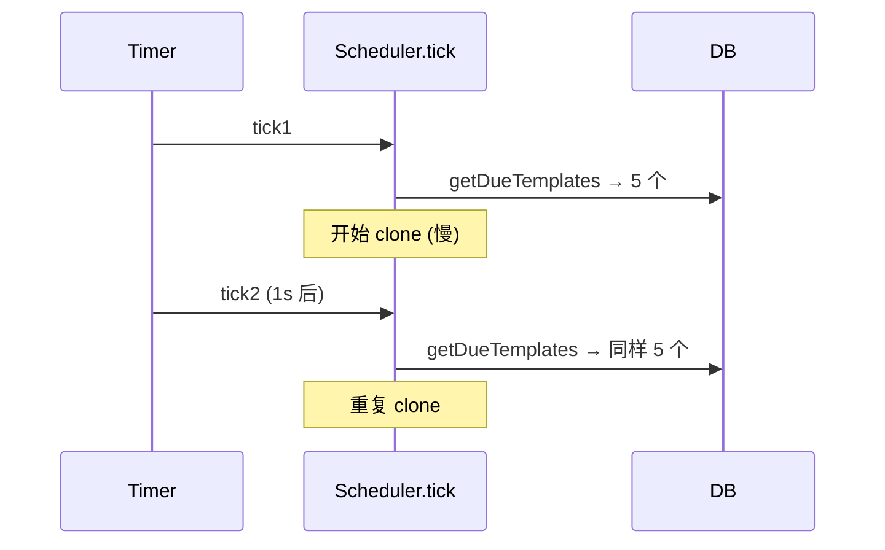

# Gateway 实现代码评审

> [!WARNING]
> 历史代码评审，问题状态不能直接套用于当前源码。需要处理其中条目时应先写复现测试；当前事实见[当前架构与决策](../architecture.md)和[运行与排障手册](../operations.md)。

> 评审范围：`src/core/db/schema.ts`、`src/worker/index.ts`、`src/core/services/task.service.ts`、`src/core/services/task-run.service.ts`、`src/core/services/task-template.service.ts`、`src/core/db/index.ts`、`src/gateway/**`、`drizzle/0003_*.sql`
> 日期：2026-05-06
> 评审人：Droid
> 置信度：8/10
> 配套文档：[2026-05-06-gateway-design-review.md](./2026-05-06-gateway-design-review.md)

总体方向贴合设计文档 v1.2 的精神（运行时态拆到 task_runs、加 PID、加 child kill 流程），但有 7 个致命级别问题会导致核心功能跑不出预期。下面按严重度排序。

---

## 🚨 致命 Bug（P0，必须修）

### 1. `null batchId` 互锁导致并发退化 — `src/worker/index.ts:73, :112`

```ts
this.activeBatchIds.add(task.batchId ?? null);
```

第一个无 `batchId` 的任务进来后，`activeBatchIds` 里有了 `null`。下一次 `tryDispatch` 调用 `TaskService.next({ excludedBatchIds: [null] })`，进入：

```ts
if (hasNullBatch) {
    conditions.push(sql`${tasks.batchId} IS NOT NULL`);  // 排除所有 null batch 的任务
}
```

**后果**：只要有一个无 batchId 任务在跑，**所有其他无 batchId 任务全部被冻结**，并发度退化为 1。

**修复方向**：`null` 表示「无批次」，根本不应入 `activeBatchIds`；只对非空 batchId 做互斥。

---

### 2. Watchdog 永远到不了 dead_letter — `src/gateway/watchdog/heartbeat.ts:21-43`

```ts
const newRetryCount = run.taskRetryCount + 1;          // 仅本地变量
if (newRetryCount >= maxRetries) {
    await TaskService.markDeadLetter(run.taskId);      // 不更新 retryCount
} else {
    await TaskService.markPendingForRetry(run.taskId, retryAfter);  // 也不更新 retryCount
}
```

`markPendingForRetry` 和 `markDeadLetter` 都**没写回 `tasks.retry_count`**，所以数据库里永远是 0。下一次心跳超时再次进 watchdog，`taskRetryCount + 1 = 1`，又判定不到 dead_letter。

**后果**：心跳超时类故障**永远不会进死信**，会无限重试。

**修复方向**：`markPendingForRetry` 和 `markDeadLetter` 都必须 `retryCount = retryCount + 1`。

---

### 3. cron 表达式的 `afterMs` 参数被忽略 — `src/gateway/scheduler/cron-parser.ts:5-10`

```ts
export function getNextCronRun(expr: string, afterMs?: number): number | null {
    const interval = CronExpressionParser.parse(expr);   // 没传 currentDate
    const fromDate = afterMs != null ? new Date(afterMs) : new Date();  // 算了没用
    const next = interval.next();                        // 永远从 "now" 算
    return next.getTime();
}
```

**后果**：`calculateNextRunAt(scheduleType, tmpl, nowMs)` 传进来的基准时间被吞，无法基于「上次运行时间」推算下次。Gateway 离线后 catch-up 语义直接错乱（`catchUp:'next'` 也不可控）。

**修复方向**：

```ts
const interval = CronExpressionParser.parse(expr, { currentDate: fromDate });
```

---

### 4. `acquireLock` 的 SQL 参数绑定方式有风险 — `src/gateway/index.ts:46-49, :73-76`

```ts
sqlite.exec(
    'INSERT INTO gateway_lock (id, pid, acquired_at, heartbeat_at) VALUES (1, ?, ?, ?)',
    [pid, now, now],   // 把数组当成第二个参数
);
```

`bun:sqlite` 的 `Database.exec(sql, ...bindings)` 是 **rest 参数**，传数组会被当作单个 binding（数组）。

**后果**：
- 要么 SQLite 抛错 → `acquireLock` 走 catch 返回 `false` → Gateway 启动失败
- 要么绑定数组导致写入异常值

**修复方向**：

```ts
sqlite.prepare('INSERT ... VALUES (1, ?, ?, ?)').run(pid, now, now);
// 或
sqlite.exec('INSERT ... VALUES (1, ?, ?, ?)', pid, now, now);
```

`releaseLock` / `updateLockHeartbeat` 同样问题，一并改。

---

### 5. Watchdog 定时器配置完全错位 — `src/gateway/watchdog/index.ts:10-20`

```ts
this.heartbeatTimer = setInterval(
    () => this.runHeartbeatCheck(),
    this.cfg.watchdog.cleanupIntervalMs,   // 心跳检查用「清理间隔」
);
this.cleanupTimer = setInterval(
    () => this.runCleanup(),
    24 * 60 * 60 * 1000,                   // 清理写死 24h，不读配置
);
```

**后果**：
- 心跳检查间隔实际是 `cleanupIntervalMs`（默认 60s，碰巧合适），但语义颠倒，配置改名/重构时极易踩雷
- `retentionDays` 配了用，但**清理周期**用户改不了
- 配置文件语义 ≠ 代码语义

**修复方向**：拆出 `heartbeatCheckIntervalMs` 和 `cleanupIntervalMs` 两个独立配置项，分别绑定对应 timer。

---

### 6. 模板时间戳永远是 0 — `src/core/db/schema.ts:108-109` + `src/core/services/task-template.service.ts:9-22`

```ts
// schema.ts
createdAt: integer('created_at').default(0),
updatedAt: integer('updated_at').default(0),
```

```ts
// task-template.service.ts
static async create(data: NewTaskTemplate): Promise<TaskTemplate> {
    const result = await db.insert(taskTemplates).values(data).returning();  // 没塞时间
    ...
}
```

**后果**：所有模板的 `createdAt = updatedAt = 0`，`list()` 按 `desc(createdAt)` 排序完全无序；`enable/disable` 写了 `updatedAt: Date.now()` 也对不上 `0` 这个基准。

**修复方向**：schema 加 `$defaultFn(() => Date.now())`，或 `create` 里显式 `createdAt: Date.now(), updatedAt: Date.now()`。

---

### 7. `getStaleRuns` 漏掉「从未心跳」的 run — `src/core/services/task-run.service.ts:104-128`

```ts
.where(
    and(
        eq(taskRuns.status, 'running'),
        sql`${taskRuns.heartbeatAt} IS NOT NULL`,   // 关键
        sql`${taskRuns.heartbeatAt} < ${cutoffMs}`,
    ),
)
```

如果 Worker 在第一次心跳（30s）之前就崩溃了，`heartbeat_at` 还是 NULL → **永远不会被识别为僵死** → 任务卡死永久 running。

**修复方向**：

```ts
or(
    and(
        sql`${taskRuns.heartbeatAt} IS NULL`,
        sql`${taskRuns.startedAt} < ${cutoffSec}`,   // 注意 startedAt 是秒级
    ),
    and(
        sql`${taskRuns.heartbeatAt} IS NOT NULL`,
        sql`${taskRuns.heartbeatAt} < ${cutoffMs}`,
    ),
)
```

注意单位转换：`startedAt` 是 drizzle `timestamp` 模式（秒级），`heartbeatAt` 是直接 `Date.now()`（毫秒）。

---

## ⚠️ 重要 Bug（P1）

### 8. 退避算法在 worker / watchdog 重复实现，参数不一致

- `task.service.ts:158` — `Date.now() + 30000 * Math.pow(2, newRetryCount - 1)`（**无上限**）
- `watchdog/heartbeat.ts:39` — `Math.min(30000 * Math.pow(2, newRetryCount - 1), MAX_BACKOFF_MS)`（30 分钟封顶）

`taskTemplates.retryBackoffMs` 字段定义了但**没人用**。

**修复方向**：抽出 `computeBackoff(retryCount, baseMs, maxMs)` 单一函数；让 task / watchdog / 模板退避都走同一函数；让 `retryBackoffMs` 真正生效。

---

### 9. Scheduler `setInterval` 不防重入 — `src/gateway/scheduler/index.ts:18`

```ts
this.timer = setInterval(() => this.tick(), this.cfg.scheduler.checkIntervalMs);
```

`setInterval` 不等 `tick` 完成。当模板很多 / DB 慢时：



`max_instances` 这层兜底虽能挡，但 `getDueTemplates → update lastRunAt/nextRunAt` 不是原子，长 tick 下仍可绕过。

**修复方向**：

- 用 `setTimeout` 链式（执行完再排下一次），或
- 加 `if (this.running) return; this.running = true; try {...} finally { this.running = false; }`

---

### 10. 关闭信号没防抖 — `src/gateway/index.ts:142-144`

```ts
process.on('SIGTERM', () => shutdown('SIGTERM'));
process.on('SIGINT', () => shutdown('SIGINT'));
```

用户连按两次 Ctrl+C → `shutdown` 并发执行：
- 两个 `worker.stop()` 同时 kill 子进程（kill 对已死进程 ESRCH，被 catch 吞了）
- 两个 `getAllRunningRuns().fail()` 竞争更新
- 两个 `closeDb()` → 第二次 close already-closed DB

**修复方向**：闭包标志位

```ts
let shuttingDown = false;
const shutdown = async (signal: string) => {
    if (shuttingDown) return;
    shuttingDown = true;
    ...
};
```

---

### 11. 配置加载违反 fail-fast — `src/gateway/config.ts:80-86`

```ts
} catch (err) {
    console.error(...);
    return DEFAULT_CONFIG;     // 静默兜底
}
```

用户改坏配置文件，Gateway 静默用默认值跑——这是项目 `~/.factory/AGENTS.md` 明确禁止的「静默兜底」。

**修复方向**：

```ts
throw new Error(`config invalid at ${CONFIG_PATH}: ${msg}`);
```

让 systemd 报错 + 重启循环让用户立刻发现。

---

### 12. `TaskService.start` 不再校验 `retryAfter`

```ts
or(
    eq(tasks.status, 'pending'),
    and(eq(tasks.status, 'failed'), sql`retryCount < maxRetries`),
)
```

`next()` 已经过滤了 `retryAfter <= now`，但 `start()` 没有。理论上不会被外部直接触发，但语义裂缝在那里——如果未来 CLI 加 `supertask run --id <n>` 强制立刻执行，会直接绕过退避。

**修复方向**：`start()` 同样加 `retryAfter IS NULL OR retryAfter <= now()` 守卫，或在文档里明确「`start` 是 `next` 的伴随原语，不允许独立调用」。

---

## 📝 次要问题（P2）

### 13. Worker 的 `model` 解析写了两遍 — `src/worker/index.ts:79, :86-87`

```ts
const run = await TaskRunService.create({ model: this.resolveModel(task.model), ... });
const rawModel = task.model;
const modelToUse = rawModel && rawModel !== 'default' ? rawModel : this.cfg.defaultModel;
```

两段语义等价但分别实现，未来一处改了另一处会漂移。

**修复方向**：统一用 `const modelToUse = this.resolveModel(task.model);` 替换两处。

---

### 14. `tryDispatch` 的循环没 catch — `src/worker/index.ts:69-156`

`while` 内部任何一步异常（如 `TaskService.start` 抛错）都会逃逸到 `poll().then(...)` 的 promise rejection，落到全局 `unhandledRejection`。

**修复方向**：在 `while` 内套 `try/catch`，确保单个任务的失败不打断 dispatch 循环。

---

### 15. `acquireLock` 重复查 `gateway_lock` — `src/gateway/index.ts:23-32`

第一句 `SELECT id, pid` 拿到了，第二句又 `SELECT heartbeat_at`。

**修复方向**：一次 `SELECT id, pid, heartbeat_at` 即可，少一次 IO。

---

### 16. `cleanupOldRecords` 双重删除 — `src/gateway/watchdog/cleanup.ts:11-26`

先 `select id` 收集，然后 `deleteByTaskIds`，再 `deleteOlderThan`。后者会重新算一次 cutoff 又删一次。逻辑能工作，但意图不清；并且两次操作之间有窗口期可能不一致。

**修复方向**：用一个事务或一次性 `DELETE FROM tasks WHERE ... RETURNING id`，再删 runs。

---

### 17. `TaskRunService.fail` 不写 `child.exitCode` — 信息丢失

仅写 log 字符串。未来排查需要 exit code、signal 名。

**修复方向**：schema 加 `exit_code INTEGER`、`exit_signal TEXT`，fail 时一并写入。

---

### 18. `STALE_THRESHOLD_MS = 30_000` 单位注释缺失 — `src/gateway/index.ts:10`

`acquired_at`/`heartbeat_at` 单位是毫秒（`Date.now()`），常量 30_000 ms 也是毫秒——一致 OK，但建议加单位注释，避免后人改坏。

---

### 19. `gateway_lock` 与 `task_templates` 创建策略不统一

- `gateway_lock` 在 `src/core/db/index.ts` 用 `CREATE TABLE IF NOT EXISTS` 直接执行
- `task_templates` 走 drizzle migration（`drizzle/0003_*.sql`）

两套创建策略并存，风格不统一。`gateway_lock` 在 schema 里没定义，新人维护时容易遗漏。

**修复方向**：把 `gateway_lock` 也纳入 drizzle schema + migration。

---

## 🔬 一致性 / 设计层面

### 20. 时间字段单位仍混乱

| 字段 | 单位 | 来源 |
|------|------|------|
| `tasks.createdAt/startedAt/finishedAt` | **秒** | drizzle `mode:'timestamp'` |
| `tasks.retryAfter/scheduledAt` | **毫秒** | 直接 `Date.now()` |
| `taskRuns.heartbeatAt/lockedAt` | **毫秒** | 同上 |
| `taskTemplates.lastRunAt/nextRunAt` | **毫秒** | 同上 |
| `taskTemplates.createdAt/updatedAt` | **毫秒**（应是） | `Date.now()` |

`task.service.ts.deleteOlderThan` 比的是秒（OK，与 `finishedAt` 一致）；`getStaleRuns` 比的是毫秒（OK，与 `heartbeatAt` 一致）。但 `tasks.startedAt`（秒）和 `taskRuns.heartbeatAt`（毫秒）做关联查询时容易踩雷（参见 P0 #7 的修复）。

**修复方向**：所有毫秒字段加 `_ms` 后缀（schema 里已有 `intervalMs/timeoutMs` 这种命名），统一规范。

---

### 21. dead_letter 状态没有 UI / CLI 表面化

`stats` 已经包含 dead_letter，`list({ status })` 类型签名也支持。但 CLI / Web 是否能筛选 dead_letter 状态？本次评审没读 `cli/` 和 `web/`，**至少要确认 UI 能看到**，否则任务被「消失」用户找不到。

**修复方向**：单独验证 + 补 UI 筛选项。

---

### 22. Worker shutdown 的重置逻辑分散在两处

- `WorkerEngine.stop()`：标记 `entry.shutdown=true`、kill 子进程、close handler 不再写 DB
- `gateway/index.ts` 的 `shutdown()`：调用 `TaskService.resetRunningToPending(runningIds)` + `TaskRunService.fail(run.id, 'Gateway shutdown')`

调试时看日志会困惑「为什么有些状态由 worker 改、有些由 gateway 改」。

**修复方向**：把「重置 task / fail run」逻辑也封到 `WorkerEngine.stop()` 里，shutdown 流程外不该手伸进 DB。

---

## Top 5 必修排序

| # | 问题 | 严重度 | 文件 |
|---|------|--------|------|
| 1 | watchdog 不更新 retryCount → 永不进 dead_letter | 致命 | `gateway/watchdog/heartbeat.ts` |
| 2 | cron 解析忽略基准时间 | 致命 | `gateway/scheduler/cron-parser.ts` |
| 3 | `null batchId` 互锁导致并发退化 | 致命 | `worker/index.ts` |
| 4 | `acquireLock` SQL 参数绑定方式可疑 | 致命 | `gateway/index.ts` |
| 5 | watchdog 定时器配置错位 + cleanup 写死 24h | 高 | `gateway/watchdog/index.ts` |

剩下的 17 项也都建议修，但上面 5 个不修这版基本跑不出预期行为。

---

## 后续动作建议

### 修复 PR 拆分

建议拆 3 个 PR，避免一次改太多：

1. **PR-1：致命修复**（P0 共 7 项）— 让 Gateway 真正可用
2. **PR-2：稳健性**（P1 共 5 项）— 防抖、fail-fast、重入保护
3. **PR-3：清理**（P2 + 一致性 共 10 项）— 统一约定、命名、API

### 测试覆盖建议

至少为以下逻辑加单元测试，避免回归：

- `cron-parser.getNextCronRun(expr, afterMs)` — 验证 afterMs 真的被使用
- `computeBackoff(retryCount)` — 退避算法（含上限）
- `TaskService.next({ excludedBatchIds })` — 验证 null batchId 不互锁
- `Watchdog.checkHeartbeats` — 验证 retryCount 写回、dead_letter 能进入
- `getStaleRuns` — 验证「从未心跳」的 run 也被识别
